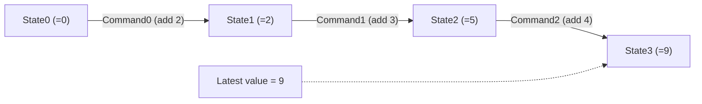
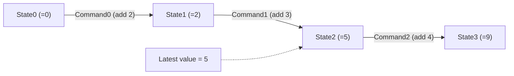
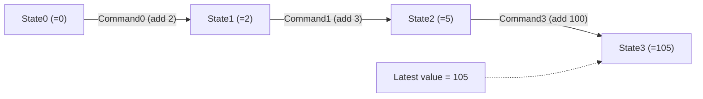

# Serdo

Serializable do/undo library.

## Abstract

- An implementation of GoF command pattern.
- By making your command serializable, you can serialize all undo information into files. And you can undo/redo operations even if you restart you application.
- You can save certain state as snapshot. You can restore the state from snapshots. You can even undo/redo after the snapshot is restored.

Fig. 1 illustrates the architecture. The application calls do() with undo information. 

Fig. 1 Abstract

## 1. Architecture

### 1.1 Command

Serdo stores changes against the model. This unit of change is called 'Command'. Let's think about a tiny calculator that can add numbers.

Fig. 1.1.1 Command

Fig. 1.1.1 illustrates commands. In this example, there are three commands applied. Each command adds 2, 3, and 4 respectively. States are values at certain points of model. If the initial state of model is zero, the latest value will be 9.

If you perform undo, the latest command 'Command2' is canceled and the model state is back to the state just after the 'Command1' was applied. The latest pointer will be updated to point 'State2' and the value will be 5 (Fig. 1.1.2).

Fig. 1.1.2 After undo performed

At the state of Fig. 1.1.2, you can perform redo to proceed to 'State3' or you can perform undo to back further to 'State0'. In both cases, the latest pointer will be updated to 'State3' or 'State0' respectively.

What about new command is added after undo is performed? If you add another command, Command 3 that adds 100, at this point, the State 3 is re-created for the command Fig. 1.1.3.

Fig. 1.1.3 Add an command (Command 3) after undo.

Undo limit can be specified. If the undo limit is specified, the oldest command will be removed when the number of commands becomes more than the limit.

### 1.2 In-memory mode and persistent mode

The `InMemoryUndoStore` is an undo store that holds commands in memory whereas the `SqliteUndoStore` holds commands in a SQLite db.

- In-memory mode is handy and fast but all commands will be lost if you restart your application.
- If you use the persistent mode, the commands are persisted. You can perform undo even if you restart your application.

